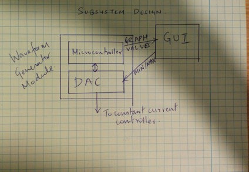
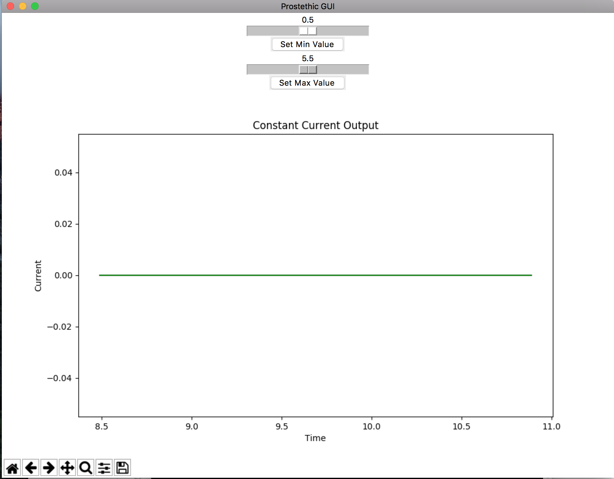
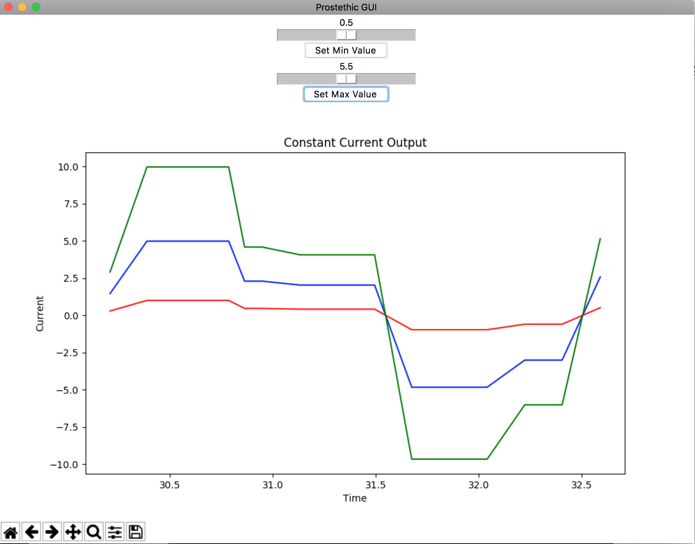

# DataSim

## Abstract

The following repository includes what I have primarily worked on my senior design project.  The portable multi-channel haptic feedback system aims to find a way to restore sensory feedback to an amputee through their prosthetic device. We achieve this using a system of tactile pressure sensors which can be embedded in a prosthetic device and a multi-channel electrical stimulator which will non-invasively provide stimulation across surface electrodes. The pressure sensors will modulate the sensation intensity as a function of the pressure measured on the fingertips
 
My part of the project deals with primarily the software side of the project. Therefore I will be working on the conversion of pressure sensor values to current values and also to implement a GUI to interact with the microcontroller circuit. The GUI will display the real time current output values and also sliders to set the default min/max values for each user.

## Introduction	
I have primarily worked on the software component of the project. This includes the Graphic User Interface and the conversion of pressure sensor values into current values in the microcontroller. However this repository will only include the GUI implementation due to a NDA.

The GUI is used to interact with the microcontroller in the sense that it polls current data in realtime to display it on the screen as well as send data to the DAC via USB to set the MIN/MAX current values determined for that particular user. The microcontroller software code interacts with the Pressure Sensor Module in so as to take in pressure sensor data. After parsing it passes these values into the DAC as voltage reference values. The DAC in turn interacts with constant current controller in the Stimulation Controller module. It passes analog voltage reference values into the constant current controller so that it produces current values. 
 
 
 
 The image above describe how the different components of the project interact with each other.
 
## GUI
 
The graphic user interface will be the mode of interfacing between the microcontroller and the external world. It is being written in Python for ease of use and versatility. We have two sliders, to set the initial current values of a person. After sliding in the appropriate values we, can then hit the ‘Set Values’ button that transfers the set values into the DAC via USB. Also concurrently the real time current values output through the constant current controller are displayed in the ‘Current Output’ graph. We poll the microcontroller for these values. The teensy microcontroller has inbuilt USB serial communication through which we can obtain the values. This part of the project is actually an add on and doesn’t really fit into one specific module. It’s primary purpose is to improve usability and customization.

The image below shows the state the GUI is in while the first Stage (i.e Setting the MIN/MAX current values) is taking place. The GUI will remain in this state until both the values are set. In this state the graph just outputs 0.

 
The image below shows the state the GUI is in while the second stage (i.e Graphing the pressure values from the microcontroller) is taking place. The GUI will remain in this state perpetually untill the program is terminated. Since we have three pressure sensors in our design, we have three graphs.

## Implementation

### gui.py	

This file contains code for the GUI side. I have used Tkinter to implement the GUI itself, while using matplotlib to chart the values. The uSB communication is handled using the serial library.

### teensycode.cpp

This file contains the code for the Arduino side. It essentially probes the USB communication for the min/max values then sends the pressure sensor values to the GUI via USB.
